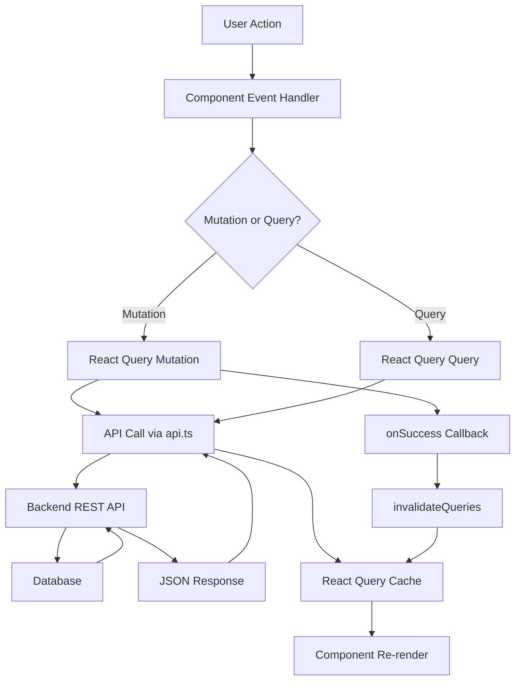

# Frontend Architecture Analysis

## Architecture Overview

The frontend is built as a React SPA using:

- **React 18.3.1** with TypeScript
- **TanStack React Query v5** for state management and data fetching
- **Vite** as the build tool
- RESTful API communication with a Python backend

## State Management Architecture

### Primary State Management: React Query

The application uses **TanStack React Query** as the primary state management solution, which handles:

- Server state caching
- Data fetching and synchronization
- Optimistic updates
- Automatic refetching and invalidation

#### Query Client Setup

Located in [`frontend/src/main.tsx`](src/main.tsx):

```typescript
const queryClient = new QueryClient();
```

The QueryClient is provided at the app root via `QueryClientProvider`.

#### Query Keys Structure

Queries are organized using hierarchical query keys:

- `["logs", dateString]` - Log entries for a specific date
- `["activeTimer"]` - Currently active timer
- `["timespans", logEntryIds]` - TimeSpans for multiple log entries (comma-separated IDs)
- Projects are fetched directly without React Query (local state in `ProjectAutocomplete`)

### Local Component State

The main [`frontend/src/App.tsx`](src/App.tsx) component manages UI-specific state using React `useState`:

- `selectedDate` - Currently selected date for viewing logs
- `editingEntry` - Log entry being edited (null when not editing)
- `isCreating` - Boolean flag for create mode

### Data Flow Architecture



## Data Fetching Patterns

### 1. Log Entries by Date

**Location**: [`frontend/src/App.tsx`](src/App.tsx) lines 49-57

```typescript
const {
  data: logs = [],
  isLoading,
  isError,
  error,
} = useQuery<LogEntry[]>({
  queryKey: ["logs", dateString],
  queryFn: () => fetchLogsByDate(dateString),
});
```

**Behavior**:

- Fetches automatically when `dateString` changes
- Returns empty array as default value
- Handles loading and error states

**API Call**: [`frontend/src/api.ts`](src/api.ts) line 27-29

```typescript
export function fetchLogsByDate(date: string): Promise<LogEntry[]> {
  return request<LogEntry[]>(`${API_BASE}/logs/${date}`);
}
```

### 2. Active Timer (Polling)

**Location**: [`frontend/src/App.tsx`](src/App.tsx) lines 39-46

```typescript
const {
  data: activeTimer,
  isLoading: timerLoading,
} = useQuery<Timer | null>({
  queryKey: ["activeTimer"],
  queryFn: getActiveTimer,
  refetchInterval: 30000, // Poll every 30 seconds
});
```

**Behavior**:

- Polls every 30 seconds to keep timer state synchronized
- Used to display real-time timer updates
- Works in conjunction with `useTimer` hook for elapsed time calculation

### 3. TimeSpans Aggregation Query

**Location**: [`frontend/src/App.tsx`](src/App.tsx) lines 196-213

```typescript
const timespansQueries = useQuery<Record<number, TimeSpan[]>>({
  queryKey: ["timespans", logs.map((e) => e.id).join(",")],
  queryFn: async () => {
    const timespansMap: Record<number, TimeSpan[]> = {};
    await Promise.all(
      logs.map(async (entry) => {
        try {
          const spans = await getTimeSpans(entry.id);
          timespansMap[entry.id] = spans;
        } catch (error) {
          timespansMap[entry.id] = [];
        }
      })
    );
    return timespansMap;
  },
  enabled: logs.length > 0,
});
```

**Behavior**:

- Dynamically fetches TimeSpans for all log entries
- Query key includes comma-separated log entry IDs
- Only runs when logs array has entries (`enabled` condition)
- Parallel fetching using `Promise.all`

## Mutation Patterns

### 1. CRUD Operations with Cache Invalidation

All mutations follow the pattern:

1. Execute mutation via `useMutation`
2. On success, invalidate related queries
3. UI automatically refetches invalidated data

**Example - Create Log** (lines 59-65):

```typescript
const createMutation = useMutation<LogEntry, Error, LogEntryCreate>({
  mutationFn: createLog,
  onSuccess: () => {
    queryClient.invalidateQueries({ queryKey: ["logs", dateString] });
    setIsCreating(false);
  },
});
```

### 2. Optimistic Updates

**TimeSpan Update** (lines 141-192) implements optimistic updates:

```typescript
onMutate: async ({ timespanId, startTimestamp, endTimestamp }) => {
  // Cancel outgoing refetches
  await queryClient.cancelQueries({ queryKey: ["timespans"] });
  
  // Snapshot previous value
  const previousTimespans = queryClient.getQueryData<Record<number, TimeSpan[]>>(
    ["timespans", logs.map((e) => e.id).join(",")]
  );
  
  // Optimistically update the cache
  queryClient.setQueryData(...);
  
  return { previousTimespans };
},
onError: (err, variables, context) => {
  // Rollback on error
  if (context?.previousTimespans) {
    queryClient.setQueryData(..., context.previousTimespans);
  }
}
```

**Benefits**:

- Immediate UI feedback
- Automatic rollback on error
- Prevents race conditions with `cancelQueries`

### 3. Multi-Query Invalidation

Timer operations invalidate multiple queries:

```typescript
onSuccess: () => {
  queryClient.invalidateQueries({ queryKey: ["activeTimer"] });
  queryClient.invalidateQueries({ queryKey: ["logs", dateString] });
}
```

## API Layer

### Structure

The API layer in [`frontend/src/api.ts`](src/api.ts) provides:

- Centralized HTTP request handling
- Type-safe API functions
- Error handling via promise rejection

### Request Helper

```typescript
async function request<T>(url: string, options: RequestInit = {}): Promise<T> {
  const response = await fetch(url, {
    headers: { "Content-Type": "application/json" },
    ...options,
  });
  if (!response.ok) {
    const message = await response.text();
    throw new Error(message || "Request failed");
  }
  if (response.status === 204) {
    return null as T;
  }
  return response.json() as Promise<T>;
}
```

### API Functions

All API functions return typed Promises:

- **Logs**: `fetchLogsByDate`, `createLog`, `updateLog`, `deleteLog`
- **Timers**: `startTimer`, `pauseTimer`, `resumeTimer`, `stopTimer`, `getActiveTimer`
- **TimeSpans**: `getTimeSpans`, `adjustTimeSpan`, `updateTimeSpan`
- **Projects**: `fetchProjects`, `createProject`, `getProject`

## Component Architecture

### Component Hierarchy

```
App (Root)
├── DateNavigator (date selection)
├── DailySnapshot (summary display)
├── LogEntryEditor (create/edit form) [conditional]
└── LogEntryCard (display/actions)
    ├── TimerControls
    └── TimeSpanList
        └── TimeSpanSession
```

### State Propagation

- **Top-Down**: Data flows from `App.tsx` queries → props → child components
- **Bottom-Up**: User actions trigger callbacks → mutations → query invalidation
- **ProjectAutocomplete**: Uses local state (not React Query) for project search

### Key Components

1. **App.tsx**: Orchestrates all data fetching and mutations
2. **LogEntryCard.tsx**: Displays log entry with timer controls
3. **LogEntryEditor.tsx**: Form for creating/editing entries
4. **ProjectAutocomplete.tsx**: Self-contained with local state and API calls
5. **TimeSpanList.tsx**: Displays time tracking sessions

## Custom Hooks

### useTimer Hook

**Location**: [`frontend/src/hooks/useTimer.ts`](src/hooks/useTimer.ts)

Calculates elapsed time for running timers:

- Tracks elapsed seconds using `setInterval` (1 second updates)
- Calculates accumulated hours from completed TimeSpans
- Formats time display
- Handles paused/running states

**Usage**: Used in components that need to display timer countdown

## Data Models

Defined in [`frontend/src/types.ts`](src/types.ts):

- **LogEntry**: Main work log entry with hours, category, project, task
- **Timer**: Active/paused timer tracking
- **TimeSpan**: Individual time tracking session
- **Project**: Project information
- **Category**: Union type of work categories

## Key Patterns & Best Practices

### 1. Query Key Dependencies

- Date-based queries use date strings as part of the key
- TimeSpan queries depend on log entry IDs (comma-separated)
- Changing query keys triggers automatic refetching

### 2. Derived Data

- Summary calculations use `useMemo` (line 217-226)
- Total hours calculated from TimeSpans + additional_hours

### 3. Conditional Queries

- TimeSpan query only enabled when logs exist (`enabled: logs.length > 0`)

### 4. Error Handling

- React Query provides `isError` and `error` states
- API errors are thrown as Error objects
- Components display error messages to users

### 5. Loading States

- Components check `isLoading` to show loading indicators
- Prevents rendering incomplete data

## Database Communication Flow

1. **User Action** → Component event handler
2. **Mutation/Query** → React Query hook
3. **API Call** → `api.ts` function → `fetch()` request
4. **Backend** → FastAPI endpoint → SQLAlchemy query
5. **Database** → SQLite (via SQLAlchemy)
6. **Response** → JSON → React Query cache
7. **UI Update** → Component re-render with new data

## Notable Design Decisions

1. **React Query Only**: No Redux/Zustand - server state handled by React Query, UI state by React hooks
2. **Polling for Timer**: Active timer polled every 30s instead of WebSocket
3. **Aggregated TimeSpan Fetching**: Single query fetches all TimeSpans for visible entries
4. **Optimistic Updates**: TimeSpan updates are optimistic for better UX
5. **Local Project State**: ProjectAutocomplete uses local state instead of React Query (could be improved)
